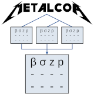

# metalcor 

`metalcor` generalizes the genetic association study meta-analysis software METAL to model studies with correlated statistics, which arise due to cryptic relatedness between studies.

This package also models the distribution of the product of correlated standard normal variables.
This is crucial for estimating correlation using the median product of z-scores, since in this case the median differs substantially from the mean.
The median provides robustness from the outliers caused by strongly associated loci.

## Installation

You can install the released version of metalcor from [CRAN](https://CRAN.R-project.org) with:
``` r
install.packages("metalcor")
```

Install the latest development version from GitHub:
```R
install.packages("devtools") # if needed
library(devtools)
install_github("OchoaLab/metalcor", build_vignettes = TRUE)
```

You can see the package vignette, which has more detailed documentation, by typing this into your R session:
```R
vignette('metalcor')
```

## Example

First load your summary statistics as data frames or tibbles, in the example below suppose they are stored in the variables `study1`, `study2`, and `study3`.
Then follow this example:

``` r
library(metalcor)
# gather the studies in a list
studies <- list( study1, study2, study3 )
# this performs the meta-analysis modeling covariance!
out <- metalcor( studies )
# this is the meta-analyzed association table
out$assoc
# and this is the estimated study covariance matrix
out$R
```

The above carries out the whole analysis for you, including the estimation of the covariance structure.
If you want to focus on estimating this covariance, and you have isolated your study z-scores into a matrix `Z`, you can use this function, and play with its parameters:
``` r
R <- estimate_R( Z )
```
Under the hood of `estimate_R` there is a whole suite of functions concerning the distribution of the product of two correlated standard normal variables, `prodcor` for short, which calibrated z-scores satisfy under the null hypothesis.
In particular, following the model of base R distributions such as `dnorm` and `dunif`, this package provides `dprodcor`, `pprodcor`, `qprodcor`, and `rprodcor`, which are the density, cumulative, quantile, and random deviate functions, respectively.
Lastly, `rho_from_median` implements the estimator of the correlation parameter given the sample median of the product of z-scores.
All of this is needed so the correlation estimates are robust to outlier z-scores, which correspond to highly associated loci.
